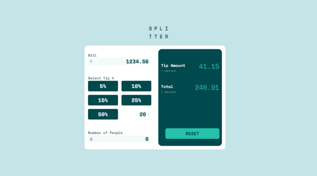
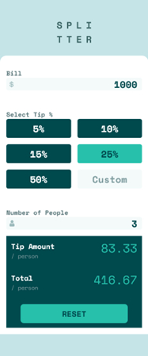

# Frontend Mentor - Tip calculator app solution

This is a solution to the [Tip calculator app challenge on Frontend Mentor](https://www.frontendmentor.io/challenges/tip-calculator-app-ugJNGbJUX). Frontend Mentor challenges help you improve your coding skills by building realistic projects.

## Overview

### The challenge

Users should be able to:

- View the optimal layout for the app depending on their device's screen size
- See hover states for all interactive elements on the page
- Calculate the correct tip and total cost of the bill per person

### Screenshot

### Links

- Solution URL: [https://github.com/toshirokubota/tip-calculator-React](https://github.com/toshirokubota/tip-calculator-React)
- Live Site URL: [https://toshirokubota.github.io/tip-calculator-React](https://toshirokubota.github.io/tip-calculator-React)

## My process

### Built with

- Semantic HTML5 markup
- CSS custom properties
- Flexbox
- CSS Grid
- Mobile-first workflow
- React
- Tailwind CSS
- SCSS/SASS
- Vite
- Vitest
- testing-library

### What I learned

- I learned how to implement unit testing with Vitest and testing-library.

### Useful resources

## Author

- Frontend Mentor - [@toshirokubota](https://www.frontendmentor.io/profile/toshirokubota)

## Acknowledgments

